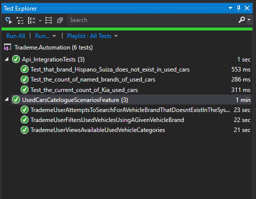

## FLUX Automation Exercise

## Index

1. Instructions
1. Tests
    1. Api Integration tests
    1. Web UI tests
1. Improvements that I could have made
1. Executing tests from command line
    1. Run Api tests
    1. Run Selenium tests
1. Executing tests from visual studio 
1. Executing tests from Docker

## Instructions

1. Automation framework and code have been implemented using .NET Core 2.1 and C# 7.0 as the language 
2. .NET Core 2.1 can be download from https://dotnet.microsoft.com/download/dotnet-core/2.1
3. I have used Visual Studio(VS) 2019 (https://visualstudio.microsoft.com/downloads/) as the IDE during development. 
4. If you wish to run tests from visual studio, you need to have Visual studio with specflow visual studio plugin (https://marketplace.visualstudio.com/items?itemName=TechTalkSpecFlowTeam.SpecFlowForVisualStudio). Tests can be run from command line without using VS as well. Please check the 'Executing tests from command line' section below for more information.
5. chromedriver.exe version 81.0.4044.69 is required to run the tests, If your chrome browser version is lower than 81.0.4044.69, you have to upgrade.
6. If you have a newer version of Chrome Browser than version 81.0.4044.69, please use the matching chromedriver.exe
7. Make sure chromedriver.exe is not being used by any other process during test execution. Use "taskkill -f -im chromedriver.exe" to kill if it's being used.

## Tests

The solution has two test projects(Api and Web UI)

### Api Integration tests

1. Api integration tests have been automated using .NET Http client and NUnit test framework
2. Only GetAsync was implemented as no other HTTP verbs were required to achieve the given task
3. No attempts were made to implement bearer token acquisition to authenticate the request as its was not required

### Web UI tests

1. Use Specflow/Webdriver and BDD approach

## Improvements that I could have made

1. Web UI tests don't have a Logger implemented(I have done it only for the Api tests).
2. Can implement a HTML report generating capability after a test run to see the pass/fail status and stats
3. Screenshots can be captured before and after every step and embed in the HTML report.
4. Use of IWebDriver in page objects and page components tightly couple the framework to selenium/webdriver.This can be eliminated by wrapping the IWebDriver to a framework-specific interface so that the framework will be agnostic of the underlying webdriver technology and plugged to a different api later on without changing the test code.
5. WebDriverFactory can be improved to run the tests using any other browser or even on mobiles using appium and RemoteWebDriver
6. Can add more hooks (Before after features / Before after steps) to gather vital information such as time taken to execute each steps to identify bottlenecks
7. Page objects and components only contain the elements/methods (MVP) that are required to achieve the workflows in scenarios.

## Executing tests from command line

### Run Api tests

1. Navigate to Api test folder where you can find the *.csproj file e.g. C:\Users\xxxx\source\repos\Trademe.Automation\Trademe.Automation.Api.Tests
2. Open command line and run "dotnet test -v m --logger trx Trademe.Automation.Api.Tests.csproj"
3. After test run is finished , open TestResults to see the test result trx file

### Run Selenium tests
1. Navigate to Api test folder where you can find the *.csproj file e.g. 
C:\Users\xxxx\source\repos\Trademe.Automation\Trademe.Automation.Web.Tests
2. Open command line and run "dotnet test -v m --logger trx Trademe.Automation.Web.Tests.csproj"
3. After test run is finished , open TestResults to see the test result trx file

## Executing tests from visual studio 

1. Select Tests > Windows > Test Explorer from the Visual studio menu
2. After successful compilation, you should see tests in the Test Explorer panel.
3. Right-click and run all or selected tests

## Executing tests from Docker

0. Change the target to "Remote" in appsettings.json of Trademe.Automation.Web.Tests project
1. You must have docker installed. Make sure you are docker (deamon) server running on Linix (If on Windows containers, switch to Linux containers)
2. On the solution root folder, build the test container using "docker build --target webtestrunner -t webuitests:latest"
3. Start the selenium hub as "docker run -d --name seleniumhub -p 4444:4444 -v /dev/shm:/dev/shm selenium/standalone-chrome"
4. Run your web ui tests as "docker run --link seleniumhub webuitests"
